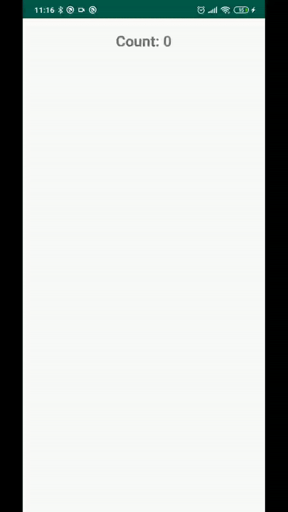

# Пример CustomView

Пример CustomView, которая:
- при нажатии на экран рисует случайную фигуру (круг, квадрат, скругленный квадрат)
- фигура рисуется случайного размера и цвета
- при достижении 10 фигур на экране, он очищается и все начинается заново

## Демонстрация:

